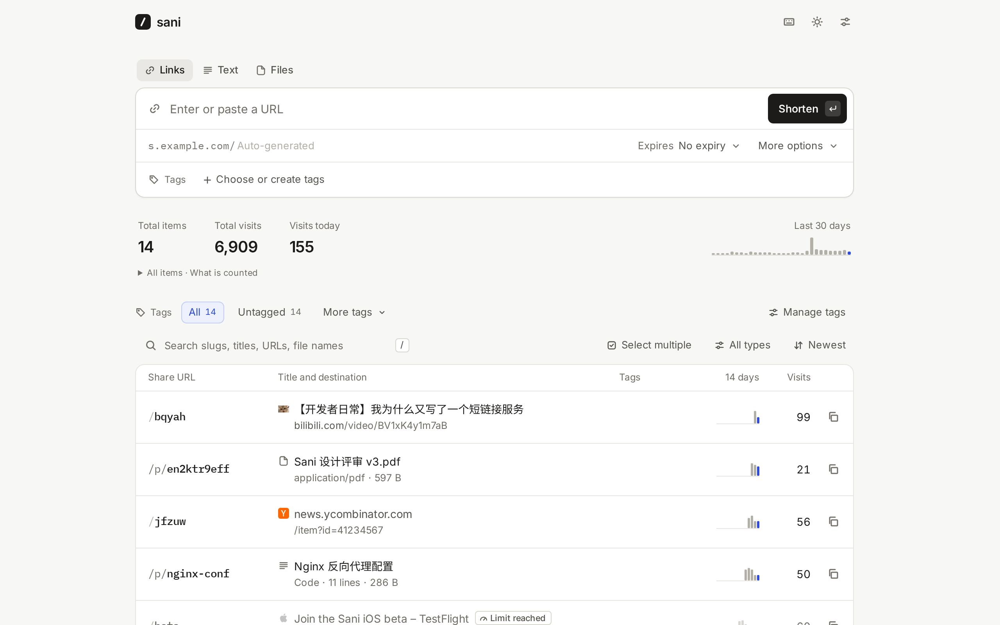

# Sani

A small, fast link shortener you host yourself. One binary, one SQLite file, no external services.

[](https://github.com/DejavuMoe/sani/actions/workflows/ci.yml)
[](https://github.com/DejavuMoe/sani/releases/latest)
[](LICENSE)

[Documentation](docs/en/guide/introduction.md) · [Releases](https://github.com/DejavuMoe/sani/releases) · [中文说明](README.zh-CN.md)

<picture>
  <source media="(prefers-color-scheme: dark)" srcset="docs/public/screenshots/dashboard-dark-en.png">
  
</picture>

Paste a long URL, press Enter, and the short link is already on your clipboard. Sani fetches the page title and icon so you can recognize links later, counts clicks without slowing redirects down, and stays out of the way otherwise.

- **Fast where it matters.** Redirects are served from memory: about 130,000 requests per second with sub-millisecond median latency on an 8-core laptop, with every click counted ([numbers below](#performance)).
- **Quick to use.** Paste a link anywhere on the page, or drop one in. Custom slugs are checked as you type, the whole dashboard works from the keyboard, and deleting offers undo instead of a confirmation dialog.
- **Simple statistics.** Total and daily clicks, top referrers, last visit. Clicks from crawlers, link previews, prefetches and your own dashboard are not counted.
- **Per-link controls.** Expiry dates, visit limits, temporary or permanent redirects, and an off switch. You can edit the destination and the change applies immediately.
- **Works with what you use.** A bookmarklet, the Android share sheet (install it as an app), API tokens for scripts and Shortcuts, and import from Shlink, Sink, YOURLS or CSV.
- **Unicode slugs.** `s.example.com/简历` works. Slugs match case-insensitively.
- **Chinese and English**, with light and dark themes, on desktop and mobile.

## Documentation

The documentation, in English and Chinese, lives in [docs/](docs/): guides for [deployment](docs/en/guide/deploy.md) and [operations](docs/en/guide/operations.md), the [configuration](docs/en/reference/configuration.md), [HTTP API](docs/en/reference/api.md) and [command line](docs/en/reference/cli.md) references, and how Sani works inside. It's a VitePress site; `make install docs-dev` serves it on `127.0.0.1:5174`, and its deploy page has a config builder that writes the deployment files for your domain. Every build checks the docs against the source, so the settings, endpoints, error codes and commands they list are the ones the code has.

## Quick start

### Docker Compose

```sh
mkdir sani && cd sani
curl -fsSLO https://raw.githubusercontent.com/DejavuMoe/sani/main/compose.yaml
# Set SANI_BASE_URL (and TZ) in compose.yaml, then:
docker compose up -d
```

Open `http://127.0.0.1:8080/admin/` and choose the admin password. The first visit also asks for the setup code Sani prints to its log (`docker logs sani`), so nobody else can claim a fresh instance; when `SANI_BASE_URL` is set, the log line includes a link with the code already filled in. Set `SANI_PASSWORD` instead to skip this step. Put a TLS reverse proxy in front of it; [deploy/](deploy/) has Caddy, nginx and systemd examples.

The image, `ghcr.io/dejavumoe/sani`, is built `FROM scratch` for `linux/amd64`, `linux/arm64` and `linux/arm/v7`: about 24 MB, running as an unprivileged user, with the data in the `/data` volume.

### A single binary

Every [release](https://github.com/DejavuMoe/sani/releases/latest) has archives for Linux, macOS, Windows and FreeBSD, with `SHA256SUMS` and build provenance:

```sh
curl -fsSL https://github.com/DejavuMoe/sani/releases/latest/download/sani-linux-amd64.tar.gz | tar -xz sani
SANI_BASE_URL=https://s.example.com ./sani
```

The binary embeds the admin app and needs nothing else at runtime. To build it yourself, `make install build` (Go 1.27+, Node 24 and pnpm) produces `./bin/sani`. `sani passwd` resets the password and signs out every session (with Docker: `docker exec -it sani /sani passwd`).

## Configuration

Everything is set through environment variables. See [.env.example](.env.example) and the [configuration reference](docs/en/reference/configuration.md).

| Variable | Default | What it does |
|---|---|---|
| `SANI_LISTEN` | `:8080` | Address to listen on. |
| `SANI_DATA_DIR` | `data` | Directory for `sani.db`. |
| `SANI_BASE_URL` | — | Public origin of your short links, e.g. `https://s.example.com`. Without it, short links use the address you're visiting; you can also set it in Settings. |
| `SANI_PASSWORD` | — | Fixed admin password (8+ characters). Without it, you choose one on first visit. |
| `SANI_SETUP_CODE` | random | The code the first visit asks for. By default a new one is generated at each start, until a password exists, and printed to the log. |
| `SANI_ROOT_REDIRECT` | — | Where the bare domain `/` goes. Defaults to the admin app. |
| `SANI_TRUST_PROXY` | `false` | Honor `X-Forwarded-*` and `X-Real-IP`; the client address is the last `X-Forwarded-For` entry. Enable only behind a proxy that sets them. |
| `SANI_SLUG_LENGTH` | `5` | Length of generated slugs. They use `23456789abcdefghjkmnpqrstuvwxyz`, with no 0/o or 1/l/i, so they survive being read aloud. |
| `SANI_FETCH_META` | `true` | Fetch the page title and icon for new links. Private and loopback addresses are never fetched. |
| `SANI_FORWARD_QUERY` | `true` | Append the visitor's query string to the destination (`/gh?utm_source=x`). |
| `SANI_CACHE_SIZE` | `100000` | Redirect targets kept in memory. |
| `SANI_LOG_LEVEL` / `SANI_LOG_FORMAT` | `info` / `text` | `debug`…`error`; `text` or `json`. |
| `TZ` | system | Time zone the daily statistics use. |

The admin app lives at `/admin/` and the API at `/api/`; every other path is a short link. The slugs `admin`, `api`, `rest`, `healthz`, `robots.txt` and the favicon names are reserved.

## Everyday use

**Keyboard.** `N` new link · `/` search · `J`/`K` move · `Enter` open · `C` copy · `E` edit · `Del` (or `⌘⌫` on a Mac) delete, with undo · `Esc` close · `?` all shortcuts. Paste a URL anywhere on the page to start shortening it.

**Bookmarklet.** Settings → Shortcuts → drag “Shorten this page” to your bookmarks bar. Clicking it on any page opens a small window that shortens that page, reusing your existing link if you've shortened it before, and copies the result.

**Phone.** Add Sani to your home screen. On Android it then appears in the Share menu of other apps.

**API.** Create a token in Settings, then:

```sh
curl -X POST https://s.example.com/api/links \
  -H "Authorization: Bearer sani_…" \
  -H "Content-Type: application/json" \
  -d '{"url": "https://example.com/some/long/path", "slug": "demo"}'
```

The [API reference](docs/en/reference/api.md) covers every endpoint and error code.

**Import and export.** Settings → Data exports every link as JSON or CSV. Import accepts Sani's own export, Shlink's JSON (`shortCode`, `longUrl`, `visitsSummary`, …), Sink's export, YOURLS or Kutt CSVs, and any CSV with a `url` column. Slugs that already exist are skipped and listed.

**Visitors.** Unknown slugs get a quiet 404 page, and expired, disabled or used-up links a 410, in Chinese or English depending on the visitor's browser.

## Performance

`make load` runs [bombardier](https://github.com/codesenberg/bombardier) against a release build: 128 connections for 15 seconds, on the same 8-core laptop (Intel Core Ultra 7 255H, WSL2) as the load generator.

| Path | Requests/s | p50 | p99 |
|---|---|---|---|
| Cached redirect, click counted | 131,075 | 0.80 ms | 3.43 ms |
| Redirect with a visit limit | 129,448 | 0.81 ms | 3.44 ms |
| Unknown slug (404 page) | 83,746 | 1.24 ms | 5.29 ms |

The script then checks the stored click total against the redirects served: in the run above, 1,965,880 redirects and 1,965,880 clicks. The handler alone costs about 0.42 µs per redirect (`make bench`). Numbers on a laptop move by 10% or so between runs; the click totals always match.

How it gets there:

- Redirect targets live in a sharded in-memory cache in front of SQLite. Misses are cached separately and bounded, so a scan for random slugs can't evict real links, and concurrent misses for the same slug share one database read.
- Counting a click is an in-memory increment. Aggregated counts reach SQLite every two seconds in one transaction, and are flushed on shutdown.
- SQLite runs in WAL mode with a single writer connection and a pool of readers, so reads never wait for writes.
- The admin app is embedded in the binary and precompressed with Brotli and gzip at build time.

[Performance](docs/en/internals/performance.md) in the docs has the method and the microbenchmarks.

## How it's built

```
cmd/sani            entry point: serve, passwd, backup, healthcheck, version
internal/server     HTTP: redirects, JSON API, embedded app, visitor pages
internal/cache      redirect cache with negative caching and a write-race guard
internal/clicks     in-memory click aggregation, flushed in batches
internal/store      SQLite (modernc.org/sqlite, no cgo), migrations, queries
internal/links      slug rules, URL normalization, Location encoding
internal/meta       title/icon fetcher with an SSRF guard
internal/auth       argon2id passwords, tokens, sign-in rate limiting
web/                the admin app: Svelte 5 + TypeScript, built with Vite
docs/               the documentation site: VitePress, checked against the source
```

Security choices worth knowing (the [security page](docs/en/internals/security.md) has the details):

- Sessions are HttpOnly, SameSite=Strict cookies scoped to `/api/`, and cross-origin requests are refused (`http.CrossOriginProtection`).
- API tokens and session secrets are stored as SHA-256 hashes, and the password as argon2id.
- A fresh instance only accepts its first password together with the setup code from its log, and sign-in and setup attempts are rate-limited per client.
- The admin app runs under a strict CSP with no inline scripts except its hashed theme bootstrap.
- Fetched favicons are served inert.
- Link destinations can't be `javascript:`, `data:` or `file:` URLs, and the title fetcher refuses private, loopback and link-local addresses, including after DNS resolution.
- Referrers come from a header anyone can forge, so each link keeps at most 200 referrer hosts and counts the rest as "Other sites".

## Development

```sh
mise install          # Go, Node and pnpm versions from mise.toml
make install          # dependencies of the admin app and the docs (one pnpm workspace)
make dev-backend      # API on 127.0.0.1:8080
make dev-frontend     # Vite on 127.0.0.1:5173/admin/, proxying /api
make demo             # a local instance with demo data (password: sani-demo)
make docs-dev         # the documentation site on 127.0.0.1:5174
make check test e2e   # gofmt, vet, type checks, the docs sync check; Go (-race) and unit tests; Playwright
make load             # the benchmark above
```

[Development](docs/en/project/development.md) in the docs lists the rules a change has to keep, and [CONTRIBUTING.md](CONTRIBUTING.md) how to propose one. Security problems go through [private reporting](SECURITY.md), not public issues.

## Data and backups

Everything lives in `sani.db` in `SANI_DATA_DIR`, a regular SQLite file in WAL mode. `sani backup FILE` writes a consistent copy while Sani keeps running; with `-` as the file name the copy goes to standard output, which is how it works with Docker, since the image has no shell:

```sh
docker exec sani /sani backup - > sani-backup.db
```

To restore, stop Sani and put the copy in place of `sani.db`; [Operations](docs/en/guide/operations.md) has the steps, a cron example and upgrades. For a portable list of your links, use Settings → Data → Export.

## License

[MIT](LICENSE)
