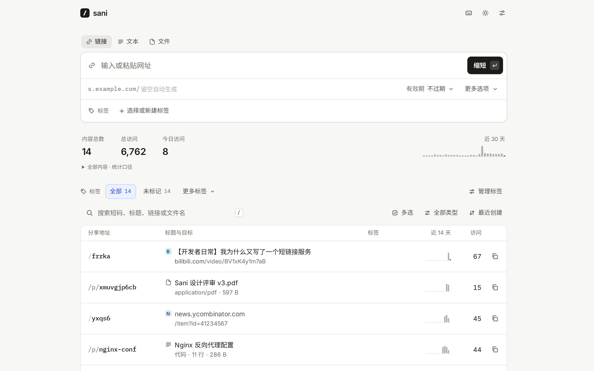

# Sani

面向单个管理员的自托管短链接、文本与文件分享服务。一个 Go 二进制文件内嵌管理界面，SQLite 保存元数据与文本，上传文件保存在本地目录，无需额外的数据库或缓存服务。

[](https://github.com/DejavuMoe/sani/actions/workflows/ci.yml)
[](https://github.com/DejavuMoe/sani/releases/latest)
[](LICENSE)

[文档](docs/guide/introduction.md) · [下载](https://github.com/DejavuMoe/sani/releases) · [English](README.md)

<picture>
  <source media="(prefers-color-scheme: dark)" srcset="docs/public/screenshots/dashboard-dark-zh.png">
  
</picture>

粘贴长链接，按下回车，短链接就已经在剪贴板里了。Sani 会自动获取网页标题和图标，方便日后辨认。点击统计不会拖慢跳转。除此之外，它不来打扰你。

- **快在该快的地方**：跳转直接从内存返回。在一台 8 核笔记本上约每秒 13 万次请求，中位延迟不到 1 毫秒，而且每一次点击都被准确计数（见下方[性能](#性能)）。
- **用起来顺手**：在页面任意位置粘贴或拖入链接即可缩短。自定义短码边输入边检查是否可用。整个控制台都可以用键盘完成。删除后可以撤销，不弹确认框。
- **够用的统计**：总点击、每日趋势、主要来源、最近访问。爬虫、链接预览、浏览器预取和你自己在控制台里的点击都不计入。
- **标签分组**：创建和编辑短链接、文本、文件时分配彩色标签，按标签筛选或查找未标记项目。标签仅供管理员使用。
- **每条链接都可控**：设置过期时间、访问次数上限，选择临时或永久跳转，也可以随时停用。修改目标链接后立即生效。
- **也能分享文本和文件**：不超过 1 MB 的笔记或配置（等宽显示，带行号），以及默认上限 99 MB 的文件，放在 `/p/…` 下，同样支持有效期、访问上限与统计。文件上传和原始内容下载需要单独的文件主机名。
- **融入你的日常**：书签小工具、Android 系统分享菜单（添加到主屏幕后），供脚本和快捷指令使用的 API 令牌，还能从 Shlink 或 Sani CSV/JSON 导入。
- **支持中文短码**：`s.example.com/简历` 可以直接使用，短码不区分大小写。
- **中文 / English 切换**，浅色 / 深色主题，桌面和手机都好用。

## 文档

Sani 面向单实例、单管理员使用，不提供多用户托管或多实例同时写入能力。目前仍处于 0.x 阶段，升级前请阅读[兼容规则](docs/project/versioning.md)和更新日志。对外服务前应配置 HTTPS、持久化存储，按需设置独立文件域名，并演练[完整备份与恢复](docs/guide/operations.md)。仓库测试和公开基准不代表具体部署的容量或可用性保证。

完整的中英文文档在 [docs/](docs/) 目录里：[部署](docs/guide/deploy.md)与[运维](docs/guide/operations.md)指南，[配置项](docs/reference/configuration.md)、[HTTP API](docs/reference/api.md) 和[命令行](docs/reference/cli.md)参考，以及 Sani 内部是怎么工作的。它是一个 VitePress 站点，`make install docs-dev` 就能在 `127.0.0.1:5174` 上浏览，部署页还有一个配置生成器，填上域名就能拿到全部部署文件。每次构建都会拿文档与源码逐项核对，所以文档里列出的配置项、接口、错误码和命令，就是代码里实际有的那些。

## 快速开始

### Docker Compose

```sh
mkdir sani && cd sani
curl -fsSLO https://raw.githubusercontent.com/DejavuMoe/sani/master/compose.yaml
# 在 compose.yaml 里设置 SANI_BASE_URL（以及 TZ），然后：
sudo install -d -m 750 -o 65532 -g 65532 ./sani-data
docker compose up -d
```

打开 `http://127.0.0.1:8080/admin/`，设置管理员密码。首次设置时还需要填写 Sani 打印在启动日志里的设置码（`docker logs sani` 查看），这样刚部署好的实例不会被别人抢先占用；设置了 `SANI_BASE_URL` 时，日志里还会给出一个已经带上设置码的链接。也可以事先用 `SANI_PASSWORD` 指定密码，跳过这一步。对外服务时请在前面加一层 TLS 反向代理，[deploy/](deploy/) 目录里有 Caddy、nginx 和 systemd 的示例。

镜像 `ghcr.io/dejavumoe/sani` 基于 `scratch` 构建，支持 `linux/amd64`、`linux/arm64` 和 `linux/arm/v7`：约 25 MB，以非特权用户运行，数据保存在 `/data` 卷中。

模板固定使用 `v0.9.3`，镜像标签保留 `v`，与 Git tag、Release 一致。请使用已发布的版本，升级时手动修改标签。数据默认绑定到 Compose 文件旁的 `./sani-data`，容器内路径为 `/data`。上面的 `install` 命令不能省略：它创建目录并设置 `65532:65532` 所有权，让容器可以写入。如果此前启动已创建了 root 所有的目录，请先[修复权限](docs/guide/deploy.md#data-permissions)。

### 单个二进制文件

每个[版本](https://github.com/DejavuMoe/sani/releases/latest)都提供 Linux、macOS、Windows 和 FreeBSD 的压缩包，附校验和与构建来源证明：

```sh
curl -fsSL https://github.com/DejavuMoe/sani/releases/download/v0.9.3/sani-linux-amd64.tar.gz | tar -xz sani
SANI_BASE_URL=https://s.example.com ./sani
```

二进制文件内嵌了管理界面，运行时不再需要其他任何东西。想自己构建，运行 `make install build`（需要 Go 1.27+、Node 24 和 pnpm），产物为 `./bin/sani`。忘记密码时，`sani passwd` 会重设密码并让所有设备退出登录（Docker 中：`docker exec -it sani /sani passwd`）。

## 配置

服务器通过环境变量配置；创建默认值也可在后台保存，重启后保留。各字段按“内置默认值 → 已保存设置 → 显式环境变量”取值；创建相关变量留空即可保留后台编辑能力。示例见 [.env.example](.env.example)，每一项的详细说明见[配置项](docs/reference/configuration.md)。

| 变量 | 默认值 | 说明 |
|---|---|---|
| `SANI_LISTEN` | `:8080` | 监听地址。 |
| `SANI_DATA_DIR` | `data` | `sani.db` 和分享文件（`files/`）所在目录。 |
| `SANI_BASE_URL` | — | 短链接使用的域名，如 `https://s.example.com`。不设置时使用你当前访问的地址，也可以在设置页里修改。 |
| `SANI_PASSWORD` | — | 固定的管理员密码（至少 8 个 Unicode 码点、最多 1,024 个 UTF-8 字节）。不设置则在首次访问时设置。 |
| `SANI_SETUP_CODE` | 随机 | 首次设置密码时要填写的设置码。默认在还没有密码时每次启动随机生成，并打印到日志里。 |
| `SANI_ROOT_REDIRECT` | — | 访问根路径 `/` 时跳转到哪里，默认进入管理界面。 |
| `SANI_TRUST_PROXY` | `false` | 信任 `X-Forwarded-*` 和 `X-Real-IP`，客户端地址取 `X-Forwarded-For` 的最后一项。只在会设置这些请求头的反向代理之后开启。 |
| `SANI_SLUG_LENGTH` | `5` | 自动生成的网址短码长度（3–32 的整数）。默认字符集为 `23456789abcdefghjkmnpqrstuvwxyz`，排除 0/o、1/l/i。 |
| `SANI_TEXT_SLUG_LENGTH` | `10` | 自动生成的文本／代码分享短码长度（3–32 的整数），独立于网址和文件，始终排除易混淆字符。 |
| `SANI_FILE_SLUG_LENGTH` | `10` | 自动生成的文件分享短码长度（3–32 的整数），独立于网址和文本，始终排除易混淆字符。 |
| `SANI_EXCLUDE_CONFUSABLE` | `true` | 自动网址短码排除 0/o、1/i/l。 |
| `SANI_META_PROXY` | — | 可选网页信息 HTTP/HTTPS/SOCKS5 代理覆盖值；未设置时可在后台配置。 |
| `SANI_FETCH_META` | `true` | 为新链接获取网页标题和图标。不会访问内网、本机等私有地址。 |
| `SANI_FORWARD_QUERY` | `true` | 把访问者的查询参数带到目标链接上（`/gh?utm_source=x`）。 |
| `SANI_CACHE_SIZE` | `100000` | 内存中缓存的跳转目标数量。 |
| `SANI_FILES_URL` | — | 第二个域名，如 `https://f.example.com`，指向同一个 Sani，用来提供分享的文件和原始文本。分享文件必须设置。 |
| `SANI_MAX_FILE_MB` | `99` | 未设置时为十进制 99 MB；显式设置仍按 MiB 计算（1–4096）。 |
| `SANI_LOG_LEVEL` / `SANI_LOG_FORMAT` | `info` / `text` | 日志级别 `debug`…`error`；格式 `text` 或 `json`。 |
| `TZ` | 系统时区 | 每日统计按这个时区划分日期。 |

管理界面位于 `/admin/`，API 位于 `/api/`，分享的文本和文件位于 `/p/`，其余路径都是短链接。`admin`、`api`、`p`、`rest`、`healthz`、`robots.txt` 和几个网站图标文件名是保留的，不能用作短码。

## 日常使用

**键盘**：`N` 新建 · `/` 搜索 · `J`/`K` 上下移动 · `回车` 展开 · `C` 复制 · `E` 编辑 · `Del`（Mac 上为 `⌘⌫`）删除，可撤销 · `X` 勾选多条链接，一次启用、停用或删除 · `Esc` 收起 · `?` 查看全部快捷键。在页面任意位置粘贴链接，就能开始缩短。

**书签小工具**：打开设置 → 快捷方式，把“缩短此页”拖到书签栏。点击后弹出小窗口，预填当前页面的网址与标题；核对后点击“缩短”，创建或复用已有短链接，再复制结果。

**手机**：在 Android 上用支持 Web Share Target 的浏览器安装 Sani 后，可从其他应用的分享菜单预填网址，核对后点击“缩短”。是否支持取决于浏览器和操作系统。

**API**：在设置里创建令牌，然后：

```sh
curl -X POST https://s.example.com/api/v1/shorten \
  -H "Authorization: Bearer sani_…" \
  -H "Content-Type: application/json" \
  -d '{"target_url": "https://example.com/some/long/path", "slug": "demo"}'
```

每个接口和错误码的说明见 [HTTP API](docs/reference/api.md)。

**文本和文件**：链接输入框上方的“文本”和“文件”标签页用来分享一段文字、一段代码或一个文件；在页面任意位置粘贴一段文字或一个文件也可以直接开始。访问者在 `/p/{短码}` 页面上阅读、复制或下载，只有你能创建。新安装时文本／代码和文件的自动短码分别默认 10 位，均可独立设为 3–32 位，长度不含 `/p/`。分享始终排除易混淆字符；低于 10 位仍可保存，后台会提示短码越短越容易被猜中，知道地址的人即可访问。

首次升级时，缺少独立设置的分享长度会按 `max(10, 旧版有效网址短码长度)` 保存，保留原有较长的值。之后修改网址长度不会影响分享，已有和手动指定的短码不变，详见[长度设置](docs/reference/configuration.md#sani-text-slug-length)。

**导入与导出**：设置 → 数据，可把网址链接及标签导出为 JSON 或 CSV；文本、文件和详细统计需通过数据库与文件备份保存。导入仅支持 Sani 原生及 Shlink 的 CSV/JSON，后台与文档提供原生格式示例。已存在的短码会被跳过，并列出原因。无损迁移请使用 JSON：CSV 为疑似电子表格公式的字段添加保护单引号，重新导入时会保留。

**访问者看到的页面**：短码不存在时显示简洁的 404 页面；链接过期、停用或次数用完时显示 410 页面。页面会按访问者的浏览器语言显示中文或英文。

## 性能

`make load` 会用 [bombardier](https://github.com/codesenberg/bombardier) 压测发布版构建：128 个并发连接，持续 15 秒。压测工具和服务运行在同一台 8 核笔记本上（Intel Core Ultra 7 255H，WSL2）。

| 路径 | 每秒请求数 | p50 | p99 |
|---|---|---|---|
| 命中缓存的跳转（计入点击） | 137,958 | 0.77 ms | 3.06 ms |
| 带访问次数上限的跳转 | 141,450 | 0.73 ms | 3.10 ms |
| 不存在的短码（404 页面） | 104,176 | 1.00 ms | 4.05 ms |

脚本最后会核对数据库中的点击总数与实际完成的跳转次数。上面这次运行中，完成了 2,069,251 次跳转，记录了 2,069,251 次点击，一次不差。单看处理函数本身，每次跳转约 0.38 微秒（`make bench`）。笔记本上每次压测的结果会有 10% 左右的浮动，但点击总数始终一致。

做法：

- 跳转目标放在 SQLite 前面的分片内存缓存里。不存在的短码单独缓存且有上限，随机扫描短码不会把真实链接挤出缓存；同一个短码的并发未命中只查一次数据库。
- 记一次点击只是内存里的一次累加。聚合后的计数每两秒合并成一个事务写入 SQLite，关闭服务时也会写入。
- SQLite 使用 WAL 模式，一个写连接加一组读连接，普通读写可并发。连接池和外部锁仍可能等待；命中的跳转不等待数据库写入。
- 管理界面内嵌在二进制中，构建时预先用 Brotli 和 gzip 压缩好。

测试方法和微基准测试见文档里的[性能](docs/internals/performance.md)。

## 项目结构

```
cmd/sani            入口：serve、passwd、backup、healthcheck、version
internal/server     HTTP：跳转、JSON API、内嵌界面、访问者页面
internal/cache      跳转缓存：未命中缓存与写入竞争保护
internal/clicks     点击的内存聚合与批量写入
internal/store      SQLite（modernc.org/sqlite，无 cgo）、迁移与查询
internal/links      短码规则、URL 规范化、Location 头编码
internal/meta       带 SSRF 防护的标题与图标获取
internal/auth       argon2id 密码、令牌、登录限流
web/                管理界面：Svelte 5 + TypeScript，Vite 构建
docs/               文档站：VitePress，构建时与源码核对
```

安全方面（详见文档里的[安全](docs/internals/security.md)）：

- 会话 Cookie 为 HttpOnly、SameSite=Strict，只作用于 `/api/`，跨站请求一律拒绝（`http.CrossOriginProtection`）。
- API 令牌和会话凭据只保存 SHA-256 哈希，密码使用 argon2id。
- 新实例只有同时提供启动日志里的设置码，才能设置第一个密码；登录和首次设置都按客户端限流。
- 管理界面启用严格的 CSP，除带哈希的主题初始化脚本外不允许内联脚本。
- 抓取来的网站图标以无害方式返回；文件域名上的一切也是如此：分享的文件和原始文本都以沙箱化的下载返回，而且这个域名上没有任何登录会话。
- 目标链接不能是 `javascript:`、`data:`、`file:` 这类地址。获取标题时拒绝内网、本机和链路本地地址，DNS 解析之后也会再检查一次。
- 来源（Referer）谁都可以伪造，所以每条链接最多记录 200 个来源网站，其余的计入“其他来源”。

## 开发

```sh
mise install          # 按 mise.toml 安装 Go、Node、pnpm
make install          # 安装管理界面和文档站的依赖（同一个 pnpm 工作区）
make dev-backend      # API 运行在 127.0.0.1:8080
make dev-frontend     # Vite 运行在 127.0.0.1:5173/admin/，/api 代理到后端
make demo             # 带演示数据的本地实例（密码：sani-demo）
make docs-dev         # 文档站运行在 127.0.0.1:5174
make check test e2e   # gofmt、vet、类型检查、文档核对；Go（-race）与单元测试；Playwright
make load             # 上面的压测
```

改动需要遵守的规则见文档里的[参与开发](docs/project/development.md)，提交改动的方式见 [CONTRIBUTING.md](CONTRIBUTING.md)。安全问题请[私下报告](SECURITY.md)，不要公开提交 issue。

## 数据与备份

链接和文本都在 `SANI_DATA_DIR` 下的 `sani.db` 里，这是一个普通的 SQLite 文件（WAL 模式）；分享的文件在旁边的 `files/` 目录里。`sani backup FILE` 会在服务运行时写出一致的数据库副本，不包含分享文件和内存中的点击；文件名写 `-` 时，副本输出到标准输出。镜像里没有 shell，所以 Docker 下这样备份：

```sh
(umask 077; set -C; docker exec sani /sani backup - > sani-backup.db)
```

完整备份需要先停止所有写入者，再把数据库与 `files/` 配套复制。恢复到新的空目录，不混入旧实例的 WAL 或文件；配套备份、恢复和升级步骤见[运维](docs/guide/operations.md)。想要可移植的链接列表，用设置 → 数据 → 导出（不包含文本和文件）。

## 许可证

[MIT](LICENSE)

对外 `/api/v1` 使用限定范围的 `sani-see-v1-2026-10-10` HTTP 兼容配置；后台操作使用 `/api/admin/v1`。升级前先在旧后台导出 JSON，正常停机并完整备份数据库、文件与配置；新版执行 `sani preflight` 后原地迁移，无需重新导入。回滚必须恢复升级前完整快照并使用旧镜像/二进制。详见[兼容矩阵](docs/reference/api.md#see)和[升级说明](docs/guide/operations.md#upgrade)。
